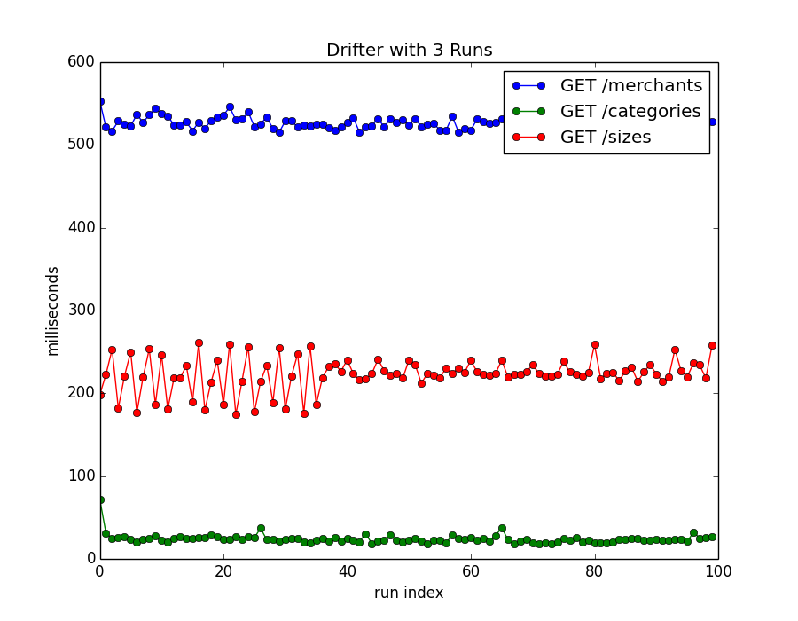
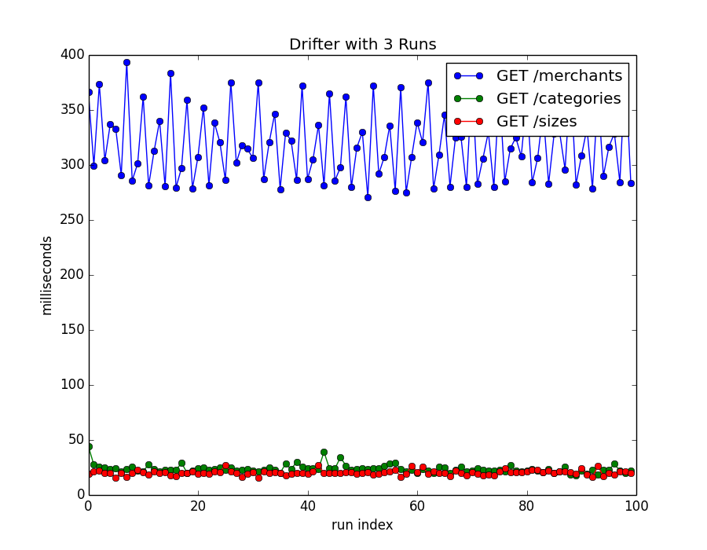
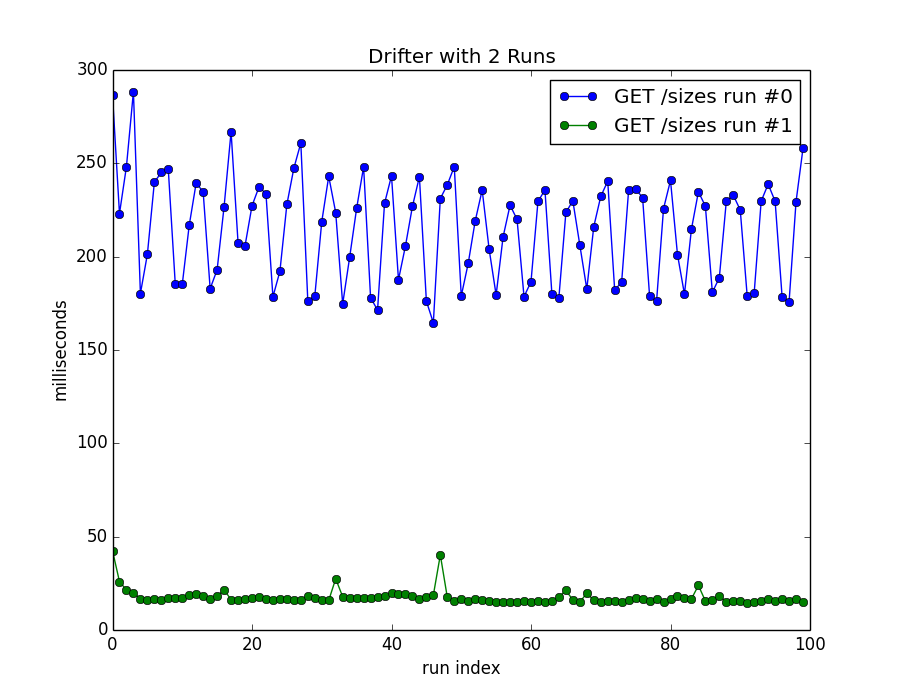
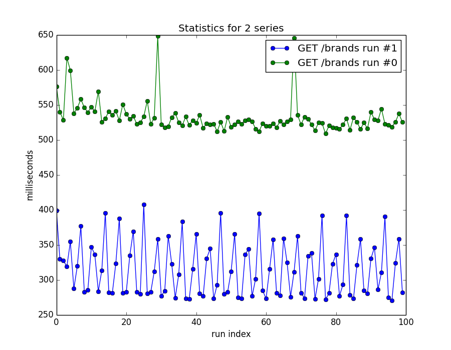
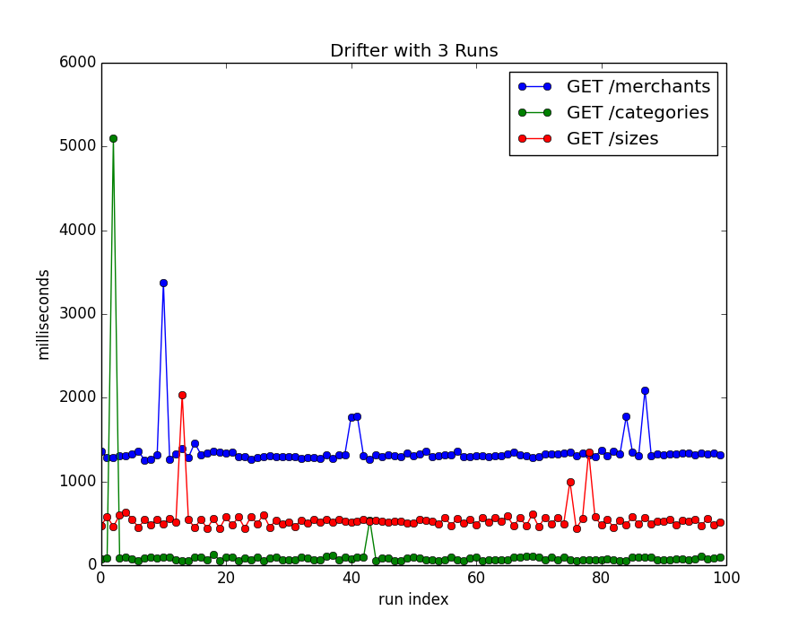
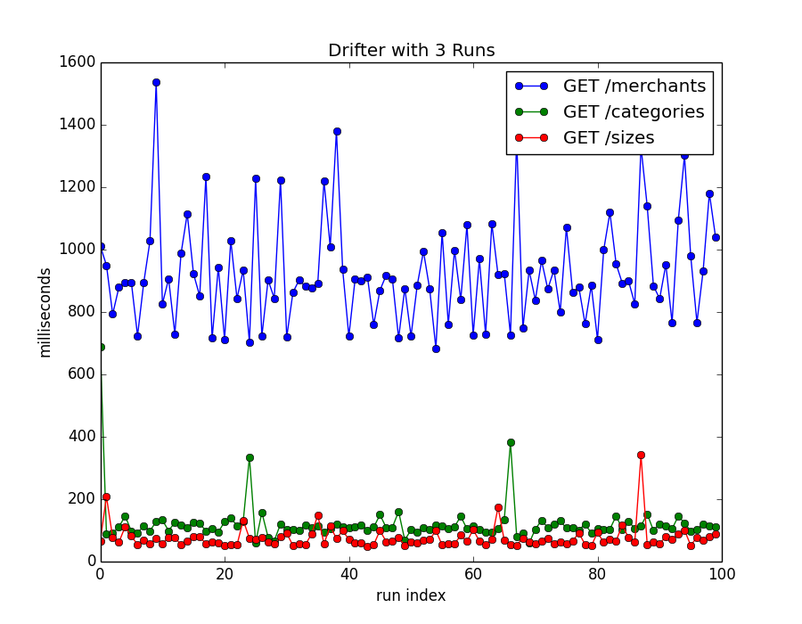

# Improving Endpoint Performance with Projections #
_Benjamin Bengfort; June 12, 2014_

An initial investigation into the speed of endpoints in our API led to the very interesting discovery that the use of [_projections_][define_projection] dramatically increases the performance of the endpoint in terms of decreasing response times. Projections are essentially a document given to a query that specifies which fields MongoDB returns in the result set. By using projections we have observed an impact in two places in the code base: dealing with data in memory on the node server, and specifically through the use of Mongoose models and schemata, as well as directly on the  Mongo database itself. 

In order to take full advantage of the speed boosts in production, we have added a static method onto our models that returns a projection object based on the amount of data required in the endpoint. For example, using an HTTP query parameter, API clients can specify a format of 'full', 'normal', or 'light' where 'normal' is the default. In the case of 'full', no projection is returned and the entire Mongo document is delivered through the front end. However, the 'normal' and 'light' formats return only a limited amount of fields. Through this technique, we have managed to speed up endpoints by approximately 12x the previous speed, a dramatic effect.

This document intends to describe the method of our investigation into the query performance, and display the results of projected vs. non projected data methods. To start, we will discuss our investigation methodology and testing framework. In the next section, we will discuss the endpoints in question, and our "standard" way to decide how to return data, as well as the baseline performance. Afterwards, we will introduce our projection technique, and report it's performance. We'll conclude with a discussion of our current thoughts about using the MMNR ([Mongo][mongodb], [Mongoose][mongoose], [Node][nodejs], [Restify][restify]) stack to produce an API for our front-end applications.

## Evaluation ##

In order to discuss the relative performance of endpoints, we must first dicuss how we evaluated performance specifically. As should be no surprise to API developers, performance is measured in terms of the milliseconds it takes to make a round trip query to the server and get a response. The faster the response, the better performing the endpoint is. 

Of course, response times vary due to a variety of factors including network speed, size of the response, size of the request, and probably even things like sun spots or traffic on the beltway. We wanted to particularly focus on the impact of both the queries in the database, as well as the handling of data on the server, and were less concerned about network latency as we have very little control of this aspect of APIs; no matter what clients of the API will be affected by other factors- but we can attempt to improve query and server speed.

In order to evaluate these variables, we created a a project in Python called [**Drifter**][drifter] that ran `n` consecutive queries against our API endpoints and measured the response time, where `n` was by default 100. Drifter then aggregated the responses for statistical significance. Using this and other parameters like "wait between queries", we were able to isolate the performance of the endpoint in terms of the backend alone. An example use of drifter is as follows:

    $ bin/drifter run -n 100 -w 0.1 -o output.json
    Executing drifter on the following endpoints:
        GET /categories
        GET /brands
        GET /sizes

    Sent: 100 requests (Elapsed Time: 0:00:11)                                                                       
    Sent: 100 requests (Elapsed Time: 0:01:35)                                                                       
    Sent: 100 requests (Elapsed Time: 0:00:08)                                                                       

    Drifter complete!
    Statistics for the GET /categories series:
        Min: 57.725
        Max: 704.772
        Median: 93.147
        Stddev: 86.722
        Variance: 7520.771
        Mean: 116.238
    Statistics for the GET /merchants series:
        Min: 693.781
        Max: 1662.335
        Median: 942.486
        Stddev: 187.462
        Variance: 35142.078
        Mean: 958.375
    Statistics for the GET /sizes series:
        Min: 50.614
        Max: 182.422
        Median: 75.012
        Stddev: 24.776
        Variance: 613.865
        Mean: 83.216
    Runner took 115.821 seconds to execute 300 runs

Although Drifter is still project specific to the endpoints that we were using, it is open source, and we will modify it to be more generic for use in other projects in the future.

All statistics and graphs in the rest of this discussion are in milliseconds, and have been generated using Drifter. Additionally, two different servers were used to test and isolate different variables. The first, called "local" means that Drifter was run on the same host as the server and the database (to eliminate any network variablity either from the client to the server or the server to the database). The local machine was a 2012 MacBook Pro with 16 GB of memory and 2.8 GHz Intel Core i7 processor. The second, called "prototype", is our deployed API in the [AWS][aws] cloud infrastructure. In this case, the Node API is hosted on [Elastic Beanstalk][eb] on m1.medium instances and the database is hosted on an r3.large instance with EBS storage and no provisioned IOPS. Both the server and the database are in the same region, Northern Virgina, as is the Drifter client. 

## Endpoints ##

Our investigation involved the use of three endpoints called `/merchants`, `/sizes`, and `/categories` respectively (note that a legacy endpoint called `/brands` may be used interchangably for the `/merchants` endpoint). These endpoints deliver typically unchanging information, that is updated approximately every week. In particular, the responses have the following properties: 

* list of brands available: returns between 5000-6000 objects in an array (356 KB)
* list of categories: returns 76-100 objects in an array (20 KB) 
* list of canonical sizes: returns 38-50 objects in an array (4 KB)

Note that the filesizes are all decompressed sizes, not network transfer sizes as our API uses Gzip compression. While it is possible that these files could simply be stored as static files on a CDN and updated on a weekly basis, we prefered to use an endpoint so that front end clients could pass filters and other query parameters. 

The creation of the endpoints is done with a Mongoose Schema, for example, our category schema is as follows:

    var Category = new Schema({
      name             : {type: String, required: true},
      slug             : {type: String, required: true},
      display_name     : {type: String, required: true},
      version          : {type: String, required: true},
      description      : {type: String, required: false, default: null},
      parent           : {type: Schema.ObjectId, ref:'Category', required: false, default: null},
      sibling_order    : {type: Number, required: false, default: null},
      created          : {type: Date, required: true, default: Date.now},
      updated          : {type: Date, required: true, default: Date.now}
    });

However, it isn't typical that we would like to send a complete document down to the client. In fact, our endpoints all accept a `?format=fmt` argument, that can specify "full", "normal", and "light" amounts of information back. In order to provide this functionality, we created a `toPublic` function the Model that is similar to `toJSON` and other methods, but determines exactly what data to send. Again, from our category schema, here is an example of this method:

    Category.methods.toPublic = function(format) {
      format = format || 'normal';

      switch(format) {
        case 'full':
          return this.toJSON();
          break;
        case 'normal':
          return {
            _id: this._id,
            name: this.name,
            slug: this.slug,
            display_name: this.display_name,
            version: this.version,
            description: this.description,
            parent: this.parent
          };
          break;
        case 'light':
          return {
            _id: this._id,
            name: this.name,
            slug: this.slug,
            display_name: this.display_name,
            version: this.version
          };
          break;
        default:
          throw new Error("Unrecognized format '" + format + "'");
          break;
      };

    };

Querying the database (using the [Q][q] promise library as well as [underscore.js][underscore]) and returning this data is very straight forward in our controllers, and looks something like as follows (note that we are using restify to create our routes):

    exports.list = function(req, res, next) {
      Q(Category.find({version: '2.0'}).exec())
        .then(function(categories) {
          categories = _.map(categories, function(category) {
            return category.toPublic(req.params.format)
          });
                
          res.send({
            categories: categories
          });
          return next();
        },
        function(err) {
          return next(err);
      });
    };

This methodology works well, but we began to notice that we didn't have quite the performance that we were hoping for, especially as our queries got larger and larger or did more and more filtering.

## Projections ##

We decided that selecting everything out of the database, even if it was not needed for the various format levels was a bit of extra work on the server, so we decided to implement projections. Simultanously, we had been investigation poor performance in the Mongo database in terms of queries- and we were stunned to discover how massive a performance improvement projections added to our endpoints! 

We generalized the projection methodology the same way that we generalized the `toPublic` functionality, this time by creating a static method on the category schema. This static method returned the projection object based on the format level (e.g. 'full', 'normal', or 'light'). Here is an example method in our code:

    Category.statics.toProjection = function(format) {
      format = format || 'normal';

      switch(format) {
        case 'full':
          return null;
          break;
        case 'normal':
          return {
            _id: 1, name: 1, slug: 1, display_name: 1,
            version: 1, description: 1, parent: 1
          };
          break;
        case 'light':
          return {
            _id: 1, name: 1, slug: 1,
            display_name: 1, version: 1
          };
          break;
        default:
          throw new Error("Unrecognized format '" + format + "'");
          break;
      };

    };

Clearly, this is very similar to the `toPublic` method but returns a projection object for use in a class, and does not operate over an instantiated model. In order to use this method in our controller, we use the following method:

    exports.list = function(req, res, next) {
      // construct the query and projection
      var query = Category.find({version: '2.0'});
      var projection = Category.toProjection(req.params.format);
      
      // add the projection if it exists
      if (projection) query = query.select(projection);

      // query the database and send
      Q(Category.find({version: '2.0'}).exec())
        .then(function(categories) {
          res.send({
            categories: _.invoke(categories, 'toJSON')
          });
          return next();
        },
        function(err) {
          return next(err);
      });
    };

Here, Mongoose uses a function called `select` to pass the projection to the native Mongo driver's `find` method. Filtering is done completely inside of the database rather than in memory on the Node server, and furthermore Mongoose does not instantiate an instance of the Category model when the data returns. 

## Results ##

The differences in the results were fairly stunning- an almost 12 times improvement in response speed using projections over using in memory formatting. Our first test involved a comparison of the endpoints before and after using the projections on the local host. Note that the `/categories` endpoint happened to already be using the projections, which is what led to our investigation in the first place. 

This first graph displays the performance of the endpoint using the `toPublic` method, after 100 runs it is clear that the `/brands` endpoint performs the worst, followed by the `/sizes` endpoint, and then the `/categories` endpoint. As previously mentioned, `/categories` already was using a projection- and because it was performing better than `/sizes`, we decided to investigate using projections (the sizes collection is actually larger than categories, but returns far fewer results).

After the projections, `/sizes` and `/categories` perform equivalently and the `/brands` endpoint loses on average 200 ms per query. Let's compare the two endpoints directly in before and after graphs:

In this graph, you can see that the first run (in blue) is the `/sizes` endpoint before the projections, and the second run (in green) is the endpoint after the projections. The non-projection method displayed a high amount of variability and a much higher mean response time than the projection methodology.

Unfortunately, in this graph the blue and green lines are reversed (thanks to matplotlib and how Python hashes dictoinaries) - however, you can see a similar result in the `/merchants` endpoint. Interestingly, it is the projection method that has a higher variance, but it does have a significantly lower mean response time than the non-projection method.

Finally, we can report our findings in a real production environment, the "prototype" environment that is hosted in AWS rather than our localhost.

Adding extra network time for database queries, as well as transport time from the cloud to a client meant that all queries in aggreagate have higher response times. However, you can see the same tiered pattern of queries, even with the higher response magnitude. 

Once again, even in production- the use of projections meant that the `/sizes` and `/categories` now perform similarly, while the `/merchants` endpoint had a significant reduction in query times (an improvement in performance). 

For those of you that like numbers, here they are:

<table>
    <thead>
        <th>Endpoint</th>
        <th>Min</th>
        <th>Max</th>
        <th>Median</th>
        <th>Std Dev</th>
        <th>Variance</th>
        <th>Mean</th>
    </thead>
    <tbody>
    <tr><td colspan="7" style="text-align:center;">Local with toPublic</td></tr>
    <tr>
<td>categories</td>
<td>17.996</td>
<td>72.084</td>
<td>23.453</td>
<td>5.941</td>
<td>35.300</td>
<td>24.156</td>
</tr>
<tr>
<td>merchants</td>
<td>515.087</td>
<td>553.311</td>
<td>525.586</td>
<td>7.140</td>
<td>50.982</td>
<td>526.712</td>
</tr>
<tr>
<td>sizes</td>
<td>174.307</td>
<td>261.222</td>
<td>223.702</td>
<td>20.114</td>
<td>404.587</td>
<td>222.996</td>
</tr>
    <tr><td colspan="7" style="text-align:center;">Local with Projections</td></tr>
    <tr>
<td>categories</td>
<td>17.557</td>
<td>44.251</td>
<td>23.117</td>
<td>3.664</td>
<td>13.429</td>
<td>23.844</td>
</tr>
<tr>
<td>merchants</td>
<td>270.961</td>
<td>393.625</td>
<td>313.800</td>
<td>33.539</td>
<td>1124.862</td>
<td>318.676</td>
</tr>
<tr>
<td>sizes</td>
<td>15.399</td>
<td>27.066</td>
<td>20.250</td>
<td>2.172</td>
<td>4.717</td>
<td>20.346</td>
</tr>
    <tr><td colspan="7" style="text-align:center;">Phoneix with toPublic</td></tr>
    <tr>
<td>categories</td>
<td>60.075</td>
<td>1051.882</td>
<td>89.284</td>
<td>132.586</td>
<td>17579.163</td>
<td>125.259</td>
</tr>
<tr>
<td>merchants</td>
<td>1346.332</td>
<td>2445.644</td>
<td>1463.164</td>
<td>200.529</td>
<td>40211.920</td>
<td>1520.057</td>
</tr>
<tr>
<td>sizes</td>
<td>425.833</td>
<td>6760.302</td>
<td>559.502</td>
<td>624.034</td>
<td>389418.209</td>
<td>645.784</td>
</tr>
    <tr><td colspan="7" style="text-align:center;">Phoneix with Projections</td></tr>
    <tr>
<td>categories</td>
<td>58.835</td>
<td>688.821</td>
<td>109.741</td>
<td>69.345</td>
<td>4808.750</td>
<td>121.535</td>
</tr>
<tr>
<td>merchants</td>
<td>683.445</td>
<td>1535.745</td>
<td>899.267</td>
<td>165.977</td>
<td>27548.270</td>
<td>926.342</td>
</tr>
<tr>
<td>sizes</td>
<td>49.056</td>
<td>341.679</td>
<td>66.256</td>
<td>36.456</td>
<td>1329.015</td>
<td>75.968</td>
</tr>
    </tbody>
</table>

## Discussion ##

Clearly the use of projections dramatically increases performance on the server in terms of lower response times for each endpoint. We believe that this performance increase comes from two places:

1. Optimized queries on the MongoDB itself
2. Computational efficiency on the server by not instantiating or serializing models

Clearly, using projections if you are going to return variable responses is absolutely a best practice, and should be used throughout an API you construct. However, we are still currently at a loss to explain why this _should_ improve performance, especially on the database side. 

Projections cannot be used everywhere, however. For example, if some computation is required on the server before a response is sent- the `toPublic` method is much more useful. A typical example is "populating" (in Mongoose terminology) related documents from other collections. In this case, while a projection might help improve performance, getting a Model back is required for automatic population. 

Finally, the use of Drifter as a tool to determine the performance of our APIs will certainly become part of our standard toolkit, and used in addition to integration and unit testing to ensure that we meet minimum QoS (Quality of Service) guidelines in our APIs. 

<!-- References -->
[define_projection]: http://docs.mongodb.org/manual/reference/glossary/#term-projection
[mongodb]: http://www.mongodb.org/
[mongoose]: http://mongoosejs.com/
[nodejs]: http://nodejs.org/
[restify]: http://mcavage.me/node-restify/
[drifter]: https://github.com/bbengfort/drifter
[aws]: https://aws.amazon.com/free/cloud-computing-free-tier/
[eb]: http://aws.amazon.com/elasticbeanstalk/
[q]: https://github.com/kriskowal/q
[underscore]: http://underscorejs.org/